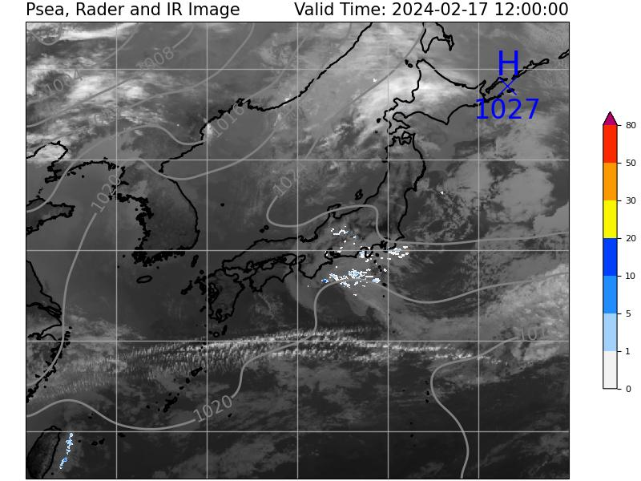

# AmedasPlot

## 注意！
* ここで表示している図は、00から30分頃：一つ前の正時、30分過ぎから59分：直近の正時の画像ですが、エラーなどによって更新が止まることがあります。
* 各種データは誤差や異常値を含む可能性がありますが、品質チェックをせずに作図しているため、不適切な情報が含まれる可能性があります。
* 等圧線と高・低気圧スタンプを表示していますが、この図は局地的な状況を確認するための資料であり、一般的に公開されている天気図（専門用語でいえば、総観規模の天気図）と矛盾する場合があります。

## 説明
* このプログラムは、アメダスの観測データ（気圧・風）とレーダーGPVを重ね書きするプログラムです。
* 今後の目標としては、過去の事例を解析できるよう、下記の気象庁HPのJSON（10日分くらいしか残らない）以外からデータを取得したいと考えていますが、誰か代わりに改修してください。
* 細かい点としては、高・低気圧の検出アルゴリズム、スムージングの掛け方、気温の表示（高度補正の有無、等温線など）、他の地域も作図するかなど検討中です。
* ご要望がありましたら、Twitterアカウント @cho_tokisen までご連絡いただければ、可能な範囲で対応いたします。

## データ取得元
* アメダスデータ:気象庁HPのJSON（ https://www.jma.go.jp/bosai/amedas/data/map/{YYYY}{MM}{DD}{HH}{mm}00.json ）
* レーダーデータ:京都大学生存圏研究所（ http://database.rish.kyoto-u.ac.jp/arch/jmadata/data/jma-radar/synthetic/original ）
* 海上の観測データの代わりに、京都大学生存圏研究所（http://database.rish.kyoto-u.ac.jp/arch/jmadata/data/gpv/original/）から取得したMSM（メソモデル）の予報値を使用しています。

## special thanks
* 黒良先生が開発・公開されているアメダスプロットコードをもとに改変しました。https://note.com/rkurora/n/n47e2099f74b0
* また、LスタンプとHスタンプの表示も、黒良先生の別のプログラム（上記記事と同じnoteで公開されています）から流用しております。
* レーダーデータのプロットはこちらを参考にしました。https://hineken.com/blog/mete_arti/jmaradar_python/
* レーダーデータのカラーバーはこちらを参照しました。https://qiita.com/earth06/items/eb579d122bb67d964c40
* 本プログラムの作成にあたっては、ChatGPT氏に多大なるご助言をいただきました。この場を借りて深く感謝申し上げます。
* その他、プログラミングに関する情報をインターネット上に公開されている各サイトから収集して作成しましたが、冗長になるため記載は省きます。
